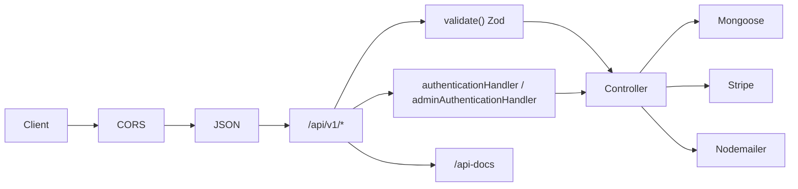

# AGENT.md — Backend E-Commerce API

Context file for AI agents and contributors. Describes what this repo is, how it is built, and where to change things safely.

---

## Project overview

**`backend_e_commerce`** is a monolithic **Node.js + TypeScript** REST API for an e-commerce storefront. It provides:

- User/admin authentication (JWT in **httpOnly cookies**)
- Product catalog (CRUD for admins, list/filter for public)
- User profile and password reset
- **Stripe Checkout** sessions tied to a **ShoppingCart** order document
- **OpenAPI/Swagger** docs (auth paths only; products/stripe mostly undocumented)

The API is versioned under **`/api/v1`**. Default dev server port is **`5001`** (see `.env`). CORS is locked to **`http://localhost:3000`** with `credentials: true` for cookie-based auth.

Planned but not implemented in-repo: Docker, microservices, CI lint/test.

---

## Tech stack

| Layer | Package | Version (package.json) | Official docs |
|--------|---------|------------------------|---------------|
| Runtime | Node.js | 18+ (Express/Stripe requirement) | https://nodejs.org/docs |
| Language | TypeScript | (via `tsx` / `tsc`) | https://www.typescriptlang.org/docs/ |
| HTTP | **express** | ^5.2.1 | https://expressjs.com/ — [v5 guide](https://expressjs.com/en/guide/migrating-5.html) |
| Database | **mongoose** | ^9.4.1 | https://mongoosejs.com/docs/ — [migrate to 9](https://mongoosejs.com/docs/migrating_to_9.html) |
| Validation | **zod** | ^4.3.6 | https://zod.dev/api |
| OpenAPI from Zod | **@asteasolutions/zod-to-openapi** | ^8.5.0 | https://github.com/asteasolutions/zod-to-openapi |
| API docs UI | **swagger-ui-express** | ^5.0.1 | https://swagger.io/tools/swagger-ui/ |
| Auth | **jsonwebtoken**, **bcrypt** | ^9.0.3, ^6.0.0 | — |
| Payments | **stripe** | ^22.1.1 | https://stripe.com/docs/api?lang=node — [SDK versioning](https://docs.stripe.com/sdks/versioning?lang=node) |
| Email | **nodemailer** | ^8.0.7 | https://nodemailer.com/about/ |
| Uploads | **multer** | ^2.1.1 | https://github.com/expressjs/multer |
| Dev runner | **tsx** | ^4.21.0 | https://github.com/privatenumber/tsx |
| Lint/format | **eslint** 10, **prettier** 3 | flat config in `eslint.config.ts` | — |

**Module system:** `"type": "commonjs"` — use `import` syntax with `esModuleInterop`; build output goes to `dist/`.

**Notable stack choices:**

- **Express 5** — uses `app.set('query parser', 'extended')` in `server.ts` for nested query objects (e.g. product sort).
- **Mongoose 9** — check breaking changes before upgrading schemas or middleware patterns.
- **Zod 4** — schemas live in `src/types/`; OpenAPI metadata via `extendZodWithOpenApi(z)` in `register.schema.ts`.
- **Stripe** — client uses pinned `apiVersion: '2026-04-22.dahlia'` in `stripe.controller.ts`; update when bumping the `stripe` package.

---

## Repository layout

```
backend_e_commerce/
├── src/
│   ├── server.ts                 # App entry: middleware, env validation, DB, routes
│   ├── config/
│   │   └── connectdb.ts          # Mongoose connect (URL_DB)
│   ├── modules/                  # Mongoose models (named *.module.ts)
│   │   ├── user.module.ts
│   │   ├── product.module.ts
│   │   ├── shoppingCart.module.ts
│   │   └── category.module.ts      # Empty schema stub
│   ├── controllers/v1/
│   │   ├── authentication.controller.ts
│   │   ├── user.controller.ts
│   │   ├── Product.controller.ts        # Public product reads
│   │   ├── admin/Product.controller.ts  # Admin CRUD + upload
│   │   └── stripe.controller.ts
│   ├── routes/v1/
│   │   ├── index.ts              # Mounts all v1 routers + swagger
│   │   ├── authentication.router.ts
│   │   ├── user.router.ts
│   │   ├── Products.routes.ts
│   │   └── stripe.router.ts
│   ├── middleware/
│   │   ├── authenticationHandler.ts   # JWT from cookie → req.userId
│   │   ├── AdminAuthHandler.ts        # Same + role === ADMIN
│   │   ├── validationHandler.ts       # Zod body/query/params
│   │   └── errorHandler.ts
│   ├── services/
│   │   ├── helpers.ts            # sendSuccess / sendError
│   │   ├── generateToken.ts
│   │   ├── setCookies.ts
│   │   ├── validateEnvFile.ts    # Zod env schema (startup)
│   │   ├── transporterMail.ts
│   │   └── uploadmulter.ts       # Multer disk storage
│   ├── types/                    # Zod request/response schemas
│   └── swagger.ts                # OpenAPI registry + /api-docs UI
├── dist/                         # tsc output (production)
├── todos.md                      # Human roadmap / gap analysis
├── AGENT.md                      # This file
├── package.json
├── tsconfig.json
└── eslint.config.ts
```

---

## Request flow



1. **`server.ts`** loads `.env` (via `tsx --env-file=.env` in dev), validates env with `envSchema`, connects MongoDB, mounts `AllRouter` at `/api/v1`, then `errorHandler`.
2. Protected routes read **`req.cookies.accessToken`**, verify with `JWT_SECRET`, set **`req.userId`** (no `express.d.ts` augmentation yet — TypeScript may complain).
3. Responses use **`sendSuccess` / `sendError`** with shape `{ success, message, data?, errors? }`.

---

## Environment variables

Validated at startup in `src/services/validateEnvFile.ts`:

| Variable | Purpose |
|----------|---------|
| `NODE_ENV` | `development` \| `production` \| `test` (default `development`) |
| `PORT` | HTTP listen port |
| `URL_DB` | MongoDB connection string |
| `JWT_SECRET` | Sign/verify access & refresh tokens |
| `SMTP_SERVER_USERNAME` | Nodemailer SMTP user |
| `SMTP_SERVER_PASSWORD` | Nodemailer SMTP password |
| `STRIPE_SECRET_KEY` | Stripe secret key |
| `UPLOAD_FOLDER` | Directory for multer uploads |

**Never commit `.env`.** Agents should not read or document secret values from a real `.env`.

---

## Scripts

| Command | What it does |
|---------|----------------|
| `npm run start:dev` | `tsx --watch --env-file=.env src/server.ts` |
| `npm run build` | `tsc` → `dist/` |
| `npm run start:prod` | `node dist/server.js` |
| `npm run lint` | ESLint on `.ts` files |
| `npm run format` | Prettier write |

**Tests:** placeholder only (`npm test` exits 1).

---

## API routes (`/api/v1`)

### Authentication — `/auth`

| Method | Path | Middleware | Handler |
|--------|------|------------|---------|
| POST | `/auth/user` | `validate(LoginSchema)` | `loginAsUser` |
| POST | `/auth/admin` | `validate(LoginSchema)` | `loginAsAdmin` |
| POST | `/auth/register` | `validate(TSchema)` | `RegisterUser` (+ welcome email) |
| POST | `/auth/auth0` | `validate(TSchema)` | `Auth0Register` (upsert OAuth user) |
| GET | `/auth/logout` | — | `loggOut` |
| GET | `/auth/refreshToken` | — | `refreshToken` |

Sets cookies: `accessToken` (15m), `refreshToken` (1d). See `setCookies.ts` (`sameSite: 'none'`, `secure` in production).

**Known bug:** logout clears `accressToken` (typo) instead of `accessToken`.

### User — `/user`

| Method | Path | Middleware | Handler |
|--------|------|------------|---------|
| GET | `/user/me` | `authenticationHandler` | `currentUser` |
| POST | `/user/reset-password` | `authenticationHandler`, `validate(ResetPasswordSchema)` | `resetPassword` |

### Products — `/product`

| Method | Path | Middleware | Handler |
|--------|------|------------|---------|
| GET | `/product` | — | `getAllProducts` (query: `title`, `limit`, `page` unused) |
| GET | `/product/filter` | — | `GetFilterProduct` (`sort`, `color`, `size`, `fabric`) |
| POST | `/product` | `adminAuthenticationHandler`, `validate(ProductZodSchema)` | `AddProduct` |
| PUT | `/product/:id` | admin + validate | `UpdateProduct` |
| DELETE | `/product/:id` | admin | `deleteProduct` |
| POST | `/product/upload` | `upload.single("image")` | `uplaodImage` |

**Missing:** `GET /product/:id` is commented out in router.

**Schema mismatch:** Zod `images[].colors` vs Mongoose `images[].color`; filter uses `images.colors`.

### Stripe — `/stripe`

| Method | Path | Middleware | Handler |
|--------|------|------------|---------|
| POST | `/stripe/create-checkout-session` | `authenticationHandler` | `createCheckoutSession` |
| POST | `/stripe/order-status` | `authenticationHandler` | `updateOrderStatus` |

- Expects **`Origin`** header and body **`items`** array (`_id`, `name`, `price`, `quantity`, `size`, `color`).
- Creates **`ShoppingCart`** doc, then Stripe Checkout `mode: 'payment'`.
- **No Stripe webhook** — frontend calls `order-status` with `order_id` + `success` boolean.

### Documentation

| Path | Description |
|------|-------------|
| `/api/v1/api-docs` | Swagger UI from Zod-registered paths (auth + partial user) |

---

## Data models (Mongoose)

### User (`user`)

- Fields: `firstName`, `secondName`, `email` (unique), `password` (bcrypt pre-save), `authProvider` (`local` \| `auth0`), `role` (`USER` \| `ADMIN`), `avatar`, `favoritsProduct[]`, refs to `Payment` / `Card`.
- Password hashed on save when modified.

### Product (`Product`)

- `title`, `description`, `images[]` (thumbnail + images + color), `size[]`, `price`, `currency` (default `MAD`), `stock`, `careAdvices`, `fabric`, `shipping`, `returnMethod`, timestamps.

### ShoppingCart (`ShoppingCart`)

- `user`, `products[]` (ProductId, size, color, quantity, price), `status` (`active` \| `completed` \| `cancelled`), `tax`, `shipping`, `total`.

### Category (`category`)

- **Empty schema** — not wired to products yet.

---

## Authentication details

- **Access token payload:** `{ userId, role }` — 15 minutes.
- **Refresh token:** 1 day; refresh endpoint re-issues access cookie via `Set-Cookie` header (slightly different cookie flags than `setCookies`).
- **Admin routes:** `adminAuthenticationHandler` requires `role === 'ADMIN'`.
- **Frontend:** must send requests with `credentials: 'include'` and match CORS origin.

---

## Code conventions (match existing style)

- **4-space indent** in TS (ESLint); Prettier uses **2-space** `tabWidth` — run `npm run format` before commit.
- **Single quotes**, semicolons required.
- Controllers: `async function name(req, res)` + try/catch → `sendSuccess` / `sendError`.
- Validation: add Zod schema in `src/types/`, wire with `validate({ body | query | params })`.
- New routes: add router file under `src/routes/v1/`, import in `index.ts`.
- Models: `src/modules/*.module.ts` using `Schema` + `model()`.
- Filenames keep existing spelling typos unless a dedicated rename task — document paths as-is.

---

## OpenAPI / Swagger

- Registry: `src/swagger.ts` — `OpenAPIRegistry` + `OpenApiGeneratorV3`.
- Register paths **before** `generateDocument()`.
- Extend Zod: `extendZodWithOpenApi(z)` in `register.schema.ts`.
- **Gap:** product, stripe, logout, refresh, reset-password paths not registered.

---

## CI

`.github/workflows/push_pr.yml` — workflow name `modimal_CI`, triggers on `dev`, `feature/**`, `fixbug/**`. Current file is **incomplete** (invalid YAML structure for GitHub Actions). Treat CI as WIP.

---

## Known issues & gaps (for agents)

Prioritize fixes only when the user asks; otherwise avoid drive-by refactors.

| Area | Issue |
|------|--------|
| Auth | Logout cookie name typo (`accressToken`) |
| Auth | `refreshToken` uses `jwt.decode` without typing; should use verified payload |
| Auth0 | `Auth0Register` sets `name` but User schema has `firstName` |
| Products | `page` query ignored; filter `createAt` typo (should be `createdAt`) |
| Products | Color field naming inconsistent (Zod vs Mongoose vs filter) |
| Stripe | No webhook; order status trusts client `success` flag |
| Stripe | `ShoppingCart` created before payment confirmation |
| Types | No `Express.Request` extension for `userId` |
| Category | Module empty |
| Tests | None |
| Swagger | Incomplete |
| User model | `shoppingCartId` ref `"Card"` vs model name `ShoppingCart` |

See **`todos.md`** for phased roadmap (Stripe → Docker → microservices → CI/CD).

---

## Package notes (recent major versions)

When upgrading dependencies, read upstream migration guides:

1. **Express 5** — routing and middleware behavior changes; see Express migrating guide.
2. **Mongoose 9** — https://mongoosejs.com/docs/migrating_to_9.html
3. **Zod 4** — https://zod.dev (API changes from v3).
4. **Stripe Node v22+** — lazy-init client if keys missing at build time (see stripe README warning); keep `apiVersion` in sync with dashboard/SDK.
5. **ESLint 10** — flat config only (`eslint.config.ts`); `ignores` inside config blocks.

---

## Safe change checklist for agents

1. Run `npm run start:dev` after env/route changes.
2. If adding env vars, update **`validateEnvFile.ts`** and document here.
3. If adding public/protected endpoints, add Zod validation + correct middleware.
4. Register OpenAPI paths in **`swagger.ts`** when exposing documented APIs.
5. Do not commit secrets or hardcode production SMTP/from addresses without user approval.
6. Match response envelope: `{ success: boolean, message: string, ... }`.

---

## Quick reference links

- Express: https://expressjs.com/
- Mongoose: https://mongoosejs.com/docs/
- Zod: https://zod.dev/
- Stripe Node: https://github.com/stripe/stripe-node
- zod-to-openapi: https://github.com/asteasolutions/zod-to-openapi
- Internal roadmap: `todos.md`
